# Goal Scorer

Goal Scorer is a small javascript game, which allow players to take penalty kicks. Depending on the level selected they will be able to select 1 possible box to determine if their selection (kick) was a goal. Players have 10 chances to try scorer as many goals as possible.  [here](https://desousamario85.github.io/Goal-Scorer/)

## Site Across Devices

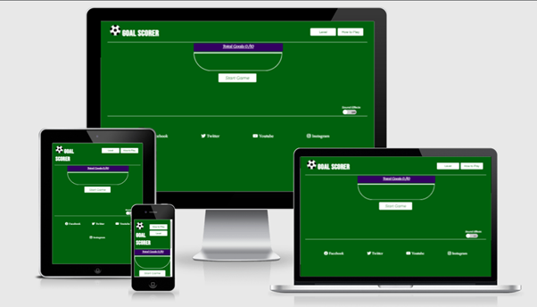

## Features 

### Navigation Options
* The Navigation has 2 buttons, which will make a modal appear.
* Level - Player can select a level before they start the game
* How to Play - Provides the players instruction on how to play the game.
* Javascript is used to make the modal appear and disappear, which removed the need to use # as an anchors.

**Desktop Navigation**

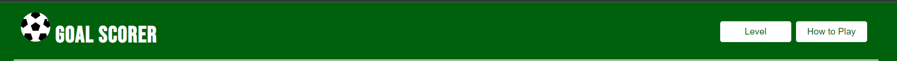

**Mobile Navigation**

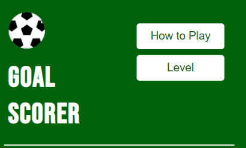


### Footer
    
* The footer contains all the common social media web links. They are place holders, and they only navigate to the each social media platform land page.

**Footer**


* Favicon
    * Following common practices and is visible in almost every website, is an icon in the address bar, which can be the company’s logo or Text.
    * For the Goal Scorer I used the logo to generate the favicon.

**Favicon**


* 404 Page
    * 404 pages are a great way to tell the users that they have navigated to a broken link and still keep them on your site.
    * Keep users on your site when they navigate to a broken link, allows the user to go back to the Home Page of the site.
    * This prevents user leaving your site and leaving the impression that the site is broken or down.
    * The Navigation buttons are removed to force the player to navigate back to the homepage.

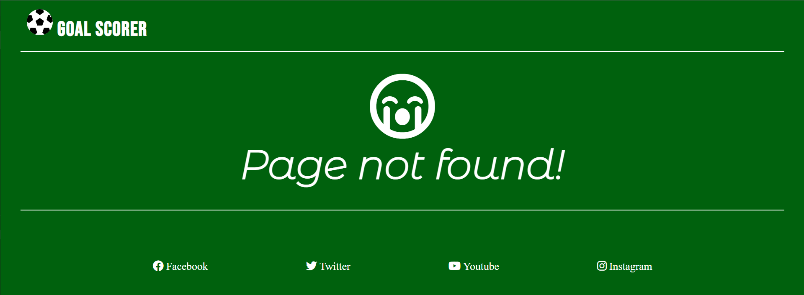

### Landing Page

The landing page of the game, is very basic. Players have the option to click on "Start Game" or click on the 2 buttons in the Navigation area, "Level" and "How to Play".

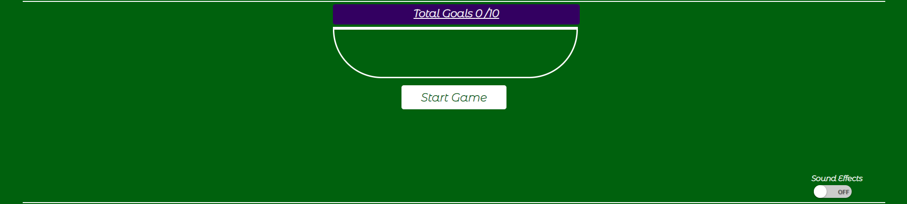

If the player selects "Start Game" they are present with Level modal, to allow them to select a Level. If the player had already select a level, they will be able to play the game, without selecting a level again.

#### Levels

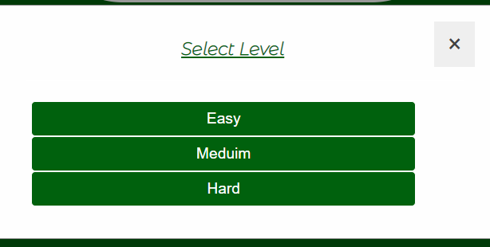

If the player wishes to change the level, they will be able to see which level they were previously on, as the current level will be highlighted.

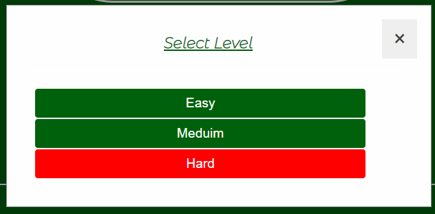

#### How to Play

Player are able to review the instruction of the game by click on "How to Play" in the navigation area. Once selected, a popup modal will appear to display the instructions.

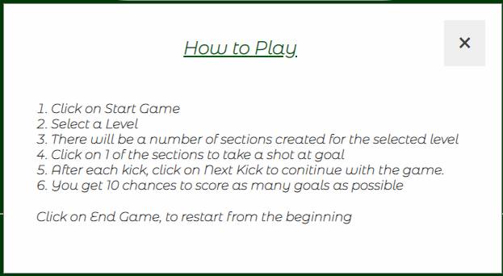


#### Audio

The game play does have some audio effect when the ball is kicked, goal scored and goal saved. by default the audio effects are turned off.

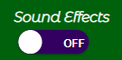

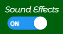


### Features Left to Implement

For future enhancement, I would like to have more animation feature in the game as it does seem very static, where there is no movement from the ball moving towards the goal.
Improved UI Design to make the game more attractive.

## Technologies

* HTML
    * HTML was used to setup the core structure of the game. 
* CSS
    * CSS stylesheet was used to style the website and gaming feature
* JavaScript
    * Javascript is the core function of the game. It handles all elements to either create/remove, show/hide and playing audio effects with in the game.

* GitPod
    * A GitPod Workspace was used to code the website. Using Code Institute GitHub Template some other predefined technologies are installed to allow developers to integrate to Git for versioning and Python3 for http Server to preview our work before committing to GitHub. I have only named 2 integrations, but the Template does include 8 or more addition extensions.
* GitHub
    * Github was used to store our committed Source Code and have a live website using GitHub Pages.
* Git 
    * Version control, integrated with GitPod
* Font Awesome
    * Font Awesome icons were obtained using free registered account https://fontawesome.com/
* Favicon.io
    * favicon files were created at https://favicon.io/favicon-generator/
* CSS Clean-up
    * https://html-cleaner.com/css/ was user to clean up my CSS file to ensure the layout was consistent.
* JS Validator
    * I used https://validatejavascript.com/ to inspect my JavaScript code and clean up any issues. Once the JS was cleaned, it was tested to ensure it had no negative effect on the game.

### Testing
 
For testing the responsiveness of the site, I used Chrome Developer Tool to resize the window from 1920px down 320px. Then same steps were applied with 50% zoom on the page. 

The site was testing on following mobile devices on Developer Tools

* iPhone SE
* Pixel 5
* Surface Pro 7
* Samsung Galaxy A51/71

### Validator Testing 

Various validating tools were used to test the site, which can seen on the reports below.

#### Lighthouse Reports

##### Home Page report


##### 404 Page report


#### w3 Validator

##### Home Page report

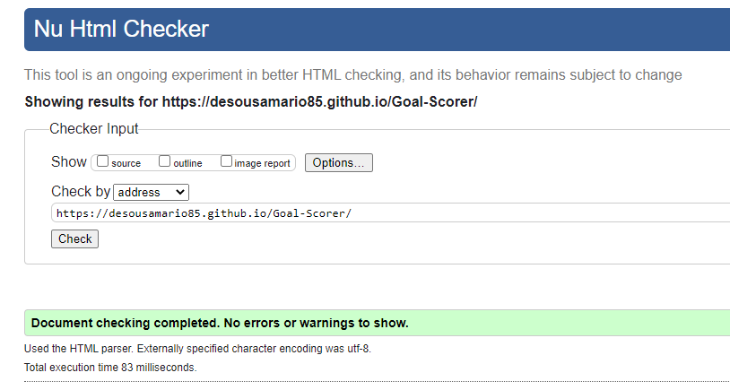

##### 404 Page report

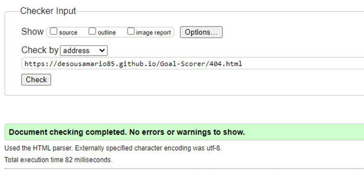


#### Jigsaw CSS Validator


#### Accessibility

Wave Evaluation tool was used to check and validate if I had any Accessibility issues

##### Homepage Wave Report


##### 404 Wave Report


### Unresolved Bugs

The webiste is responding great to the variuos mobile and desktop browsers. On the Mobile device the "X" in the mobile device has a line running through it when hovered over. This will be resolved on the next update of the website, when we start introducing more technologies to the site.

## Deployment

### Versioning

The site was created using the GitPod workspaces which had Git installed part of it's extentions.

Git commands were used to push through our code to Github, which can be seen below.

``` git add <filename> ``` This command was used to add the file(s) to the staging area before they are committed.
Most of the time ``` git add . ``` was used to stage the files for committing

``` git commit -m “commit message” ``` This allows us to commit our changes to the local repository
```git push``` pushes our code to GitHub to be published to our live site on Github Pages 

#### Deployment to Github Pages

The site was deployed to GitHub pages. The following steps were used to deploy the site.

1. In the GitHub repository, navigate to the Settings tab

2. From the menu on left select 'Pages'
3. From the source section drop-down menu, select the Branch: main
4. Click 'Save'
5. A live link will be displayed in a green banner when published successfully.


### Content 

All written content on the site is my own is based on services that ,as a parent would like to see offered in 1 central location.

### Media

All Images on the site were provided and freely available on the listed sites below.

* https://www.pexel.com
* https://iconscout.com/illustrations/404-error
* Photo by <a href="https://unsplash.com/@artem_kniaz?utm_source=unsplash&utm_medium=referral&utm_content=creditCopyText">Artem Kniaz</a> on <a href="https://unsplash.com/s/photos/children-playing?utm_source=unsplash&utm_medium=referral&utm_content=creditCopyText">Unsplash</a>

### Credits

Thanks to all forum contributors on the listed weblink which helped me code or resolve issues during the project. Their sample code or explanation helped me to include or add the functions on the website that I wanted.

* https://getpublii.com/blog/one-line-css-solution-to-prevent-anchor-links-from-scrolling-behind-a-sticky-header.html
* https://www.sliderrevolution.com/resources/css-modal/
* https://stackoverflow.com/questions/37738278/how-to-create-an-hours-of-operation-list-with-html-and-css

To my mentor Daisy for providing a ReadMe Template , produced by Gareth-McGirr.